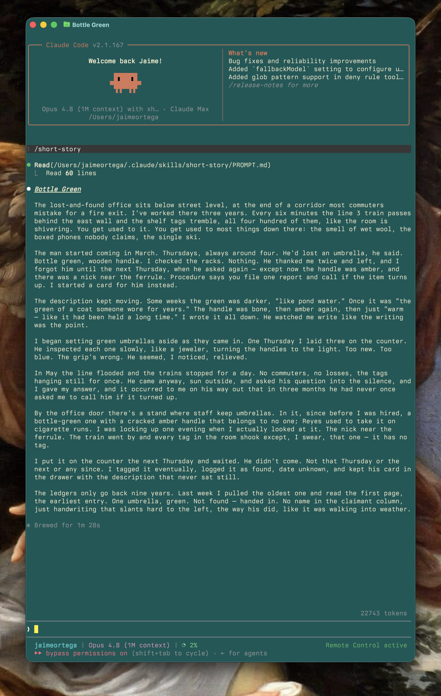

# Short Story

A Claude skill that writes literary short fiction — under 4,000 characters, first person, set in a contemporary city that is never named.



## Where it comes from

In one of his notebooks, Chekhov jotted down an anecdote: *a man in Monte Carlo goes to the casino, wins a million, returns home, kills himself.*

Ricardo Piglia opens his **"Tesis sobre el cuento"** (*Formas breves*) with that note and derives his first thesis from it: **"Un cuento siempre cuenta dos historias"** — a short story always tells two stories. A visible one on the surface, and a secret one built *"with the unsaid, with the implied, and with allusion"*, encrypted in the gaps of the first. In the modern story — Chekhov, Katherine Mansfield, the Joyce of *Dubliners* — the two are told as if they were one, and the tension between them is never resolved.

## How that lands in the skill

Every story is constructed on those two planes:

- **Visible story** — a self-contained moment in an unnamed city: something happens, something changes, something stays latent.
- **Secret story** — a thematic undercurrent that is never named. It rides a subtle vehicle (an object, a habit, a light, a delay) and gets encoded through gestures, omissions, micro-repetitions, and one small crack in the logic.

No twist ending — that's the classic Poe mode. These stories close in the modern register: apparent resolution, plus a residue — a final detail that reorders the meaning if you look at it twice.

## Install

Copy the folder into your skills directory:

```sh
git clone https://github.com/JaimeOrtegaxyz/short-story.git ~/.claude/skills/short-story
```

Or into `.claude/skills/short-story/` inside a project to scope it there.

## Use

Invoke `/short-story` or just ask for a short story. One story per run, ≤4,000 characters including the title. English by default; same rules apply in Spanish on request.

- `SKILL.md` — the contract (length, voice, output)
- `PROMPT.md` — the full construction rules for both planes